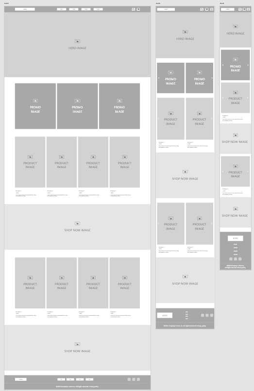

# Nathalia Lima Midterm - MMED-1056 - Web Development 1
This repo is for Web Development 1 Midterm Part 2 - HTML Boxed Responsive Layouts

___

## About the project

This website was created to show skills in scaffold design for Midterm.

___

## Installation

There is no installation required.

## Usage

Open index.html in the browser of your choice.

## Contributing

1. Fork it!
2. Create your feature branch: `git checkout -b my-new-feature`
3. Commit your changesL `git commit -am 'Add some feature'`
4. Push to the branch: `git push origin my-new-feature`
5. Submit a pull request :D

## History

March 01, 2024

## Credits

Nathalia Lima

## License

MIT - please see [license file](LICENSE).
